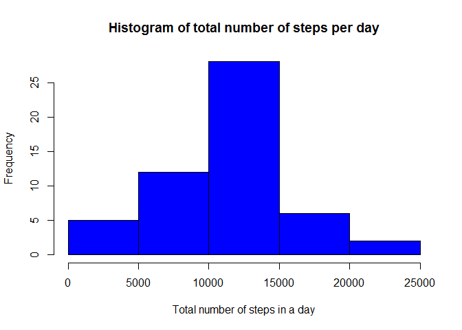
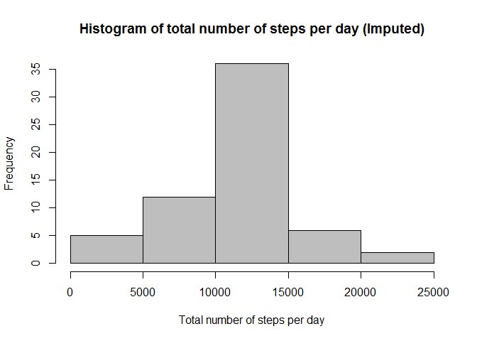
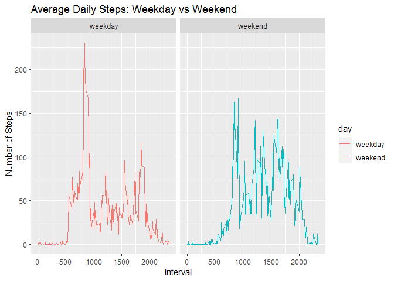

## Introduction
It is now possible to collect a large amount of data about personal movement using activity monitoring devices such as a Fitbit, Nike Fuelband, or Jawbone Up. These type of devices are part of the "quantified self" movement -- a group of enthusiasts who take measurements about themselves regularly to improve their health, to find patterns in their behavior, or because they are tech geeks. But these data remain under-utilized both because the raw data are hard to obtain and there is a lack of statistical methods and software for processing and interpreting the data.

This assignment makes use of data from a personal activity monitoring device. This device collects data at 5 minute intervals through out the day. The data consists of two months of data from an anonymous individual collected during the months of October and November, 2012 and include the number of steps taken in 5 minute intervals each day.

## Data
The data for this assignment can be downloaded from the course web site:
* Dataset: [Activity monitoring data](https://d396qusza40orc.cloudfront.net/repdata%2Fdata%2Factivity.zip)

The variables included in this dataset are:
steps: Number of steps taking in a 5-minute interval (missing values are coded as NA)
date: The date on which the measurement was taken in YYYY-MM-DD format
interval: Identifier for the 5-minute interval in which measurement was taken
The dataset is stored in a comma-separated-value (CSV) file and there are a total of 17,568 observations in this dataset.

## Loading and preprocessing the data
#### Downloading & extracting source data file

```r
fileUrl <- "https://d396qusza40orc.cloudfront.net/repdata%2Fdata%2Factivity.zip"
#download.file(fileUrl,destfile = "activity.zip")
#unzip("activity.zip")
```
#### Loading any required libraries

```r
library(ggplot2)
```

```
## Warning: package 'ggplot2' was built under R version 3.4.4
```

```r
library(knitr)
```
#### Reading in, exploring, and cleaning the data

```r
data <- read.csv("activity.csv")
dim(data)
```

```
## [1] 17568     3
```

```r
str(data)
```

```
## 'data.frame':	17568 obs. of  3 variables:
##  $ steps   : int  NA NA NA NA NA NA NA NA NA NA ...
##  $ date    : Factor w/ 61 levels "2012-10-01","2012-10-02",..: 1 1 1 1 1 1 1 1 1 1 ...
##  $ interval: int  0 5 10 15 20 25 30 35 40 45 ...
```

```r
summary(data)
```

```
##      steps                date          interval     
##  Min.   :  0.00   2012-10-01:  288   Min.   :   0.0  
##  1st Qu.:  0.00   2012-10-02:  288   1st Qu.: 588.8  
##  Median :  0.00   2012-10-03:  288   Median :1177.5  
##  Mean   : 37.38   2012-10-04:  288   Mean   :1177.5  
##  3rd Qu.: 12.00   2012-10-05:  288   3rd Qu.:1766.2  
##  Max.   :806.00   2012-10-06:  288   Max.   :2355.0  
##  NA's   :2304     (Other)   :15840
```

```r
head(data)
```

```
##   steps       date interval
## 1    NA 2012-10-01        0
## 2    NA 2012-10-01        5
## 3    NA 2012-10-01       10
## 4    NA 2012-10-01       15
## 5    NA 2012-10-01       20
## 6    NA 2012-10-01       25
```
#### remove all NA data

```r
dataComplete <- na.omit(data)
summary(dataComplete)
```

```
##      steps                date          interval     
##  Min.   :  0.00   2012-10-02:  288   Min.   :   0.0  
##  1st Qu.:  0.00   2012-10-03:  288   1st Qu.: 588.8  
##  Median :  0.00   2012-10-04:  288   Median :1177.5  
##  Mean   : 37.38   2012-10-05:  288   Mean   :1177.5  
##  3rd Qu.: 12.00   2012-10-06:  288   3rd Qu.:1766.2  
##  Max.   :806.00   2012-10-07:  288   Max.   :2355.0  
##                   (Other)   :13536
```

## What is mean total number of steps taken per day?
Calculate the total number of steps taken per day
Make a histogram of the total number of steps taken each day
Calculate and report the mean and median of the total number of steps taken per day

```r
dataSteps <- aggregate(steps ~ date, dataComplete, sum)
hist(dataSteps$steps, col="blue", main="Histogram of total number of steps per day", xlab="Total number of steps in a day")
```

<!-- -->

```r
mean(dataSteps$steps)
```

```
## [1] 10766.19
```

```r
median(dataSteps$steps)
```

```
## [1] 10765
```


## What is the average daily activity pattern?
Make a time series plot of the 5-minute interval (x-axis) and the average number of steps taken, averaged across all days (y-axis)
Which 5-minute interval, on average across all the days in the dataset, contains the maximum number of steps?

```r
dataIntervalSteps <- aggregate(steps ~ interval, dataComplete, mean)
str(dataIntervalSteps)
```

```
## 'data.frame':	288 obs. of  2 variables:
##  $ interval: int  0 5 10 15 20 25 30 35 40 45 ...
##  $ steps   : num  1.717 0.3396 0.1321 0.1509 0.0755 ...
```

```r
with(dataIntervalSteps, plot(interval, steps, type='l', col="brown", main="Average number of steps by 5-minute interval", xlab="5-minute Interval", ylab="Average number of steps"))
```

<!-- -->

```r
dataIntervalSteps[(which.max(dataIntervalSteps$steps)),]
```

```
##     interval    steps
## 104      835 206.1698
```


## Imputing missing values
#### by replacing NA values with the mean value
Calculate and report the total number of missing values in the dataset (i.e. the total number of rows with NAs)

```r
nrow(data[!complete.cases(data),])
```

```
## [1] 2304
```
Perform the imputation by looping through the rows and replacing NA with the mean value
Create a new dataset that is equal to the original dataset but with the missing data filled in.

```r
dataFilled  <- data
for (i in 1:nrow(dataFilled))
{
  if (is.na(dataFilled$steps[i]))
  {
    x <- dataIntervalSteps$steps[dataIntervalSteps$interval == dataFilled$interval[i]];
    dataFilled$steps[i] <- x;
  }
}
sum(is.na(dataFilled))
```

```
## [1] 0
```

```r
str(dataFilled$steps)
```

```
##  num [1:17568] 1.717 0.3396 0.1321 0.1509 0.0755 ...
```

Make a histogram of the total number of steps taken each day

```r
dataImputedSteps <- aggregate(steps ~ date, dataFilled, sum)
hist(dataImputedSteps$steps, col="grey", main="Histogram of total number of steps per day (Imputed)", xlab="Total number of steps per day")
```

<!-- -->

Calculate and report the mean and median total number of steps taken per day.

```r
mean(dataImputedSteps$steps)
```

```
## [1] 10766.19
```

```r
median(dataImputedSteps$steps)
```

```
## [1] 10766.19
```

#### Do these values differ from the estimates from the first part of the assignment?
Answer: The mean remains unchanged, but there is a very slight difference with the median. 

#### What is the impact of imputing missing data on the estimates of the total daily number of steps?
Answer: The total number of steps per day is increased.


## Are there differences in activity patterns between weekdays and weekends?
Create a new factor variable in the dataset with two levels – “weekday” and “weekend” indicating whether a given date is a weekday or weekend day.

```r
dataFilled$day <- "weekday"
dataFilled$day[weekdays(as.Date(dataFilled$date), abb=T) %in% c("Sat","Sun")] <- "weekend"
table(dataFilled$day)
```

```
## 
## weekday weekend 
##   12960    4608
```

Make a panel plot containing a time series plot (i.e. type = “l”) of the 5-minute interval (x-axis) and the average number of steps taken, averaged across all weekday days or weekend days (y-axis).

```r
dataFilledMean <- aggregate(steps ~ interval + day, data=dataFilled, FUN="mean")
ggplot(dataFilledMean, aes(x=interval, y=steps, color=day)) + geom_line() + labs(title="Average Daily Steps: Weekday vs Weekend", x="Interval", y="Number of Steps") + facet_wrap(~day, ncol=2, nrow=2)
```

<!-- -->
